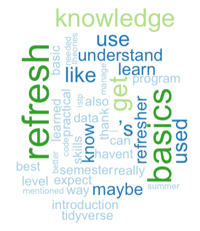
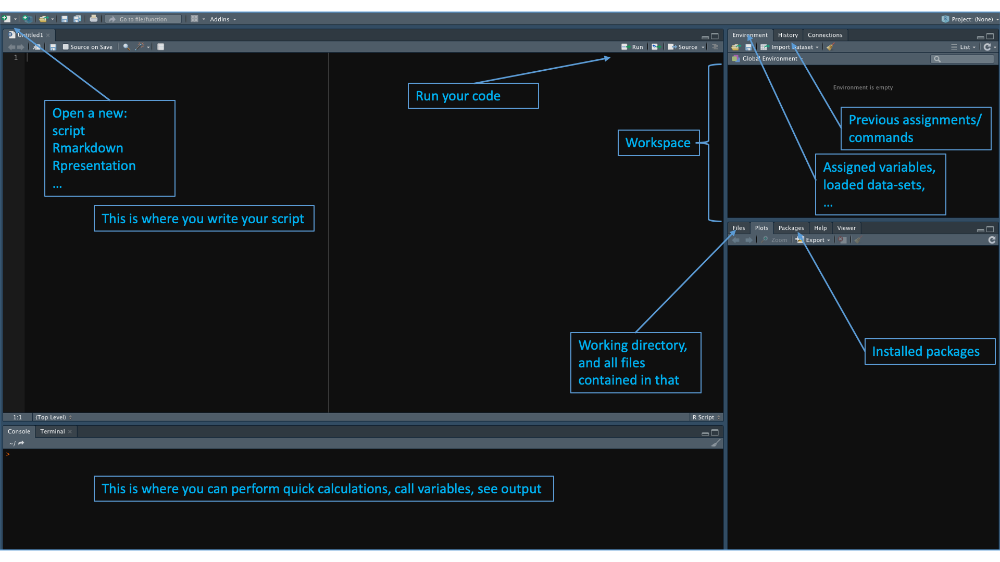
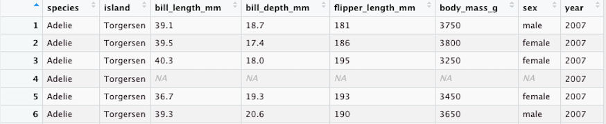

```{r setup, include=FALSE, warning=FALSE}
options(htmltools.dir.version = FALSE)
knitr::opts_chunk$set(fig.retina = 3, message = FALSE) #rendering sharp plots / not showing messages
setwd("~/Desktop/Student representation ISTP/rbootcamp/part1/")
library(readxl)
library(tidyverse)
library(ggplot2)
library(kableExtra)
library(readxl)
library(wordcloud)
library(tm)
library(RColorBrewer)
library(plotrix)
library(xaringanthemer)
style_mono_light(base_color = "#23395b")

intro_full <- read_excel("Umfrage_intro.xlsx")
intro <- intro_full[-1,]

```

# Some poll results :)

---
# Previous R experience

```{r, message = FALSE, echo=FALSE}
# Do you have any experience using R?
# n = 26

intro %>%  
  head(n=6) %>% 
  select(use_R, use_R_answer) %>% 
  mutate(name = fct_reorder(use_R_answer, use_R)) %>% 

  ggplot() + aes(name, use_R) + 
  geom_bar(stat = "identity", fill = "#E69F00") + # width = 0.6, vjust = -10
  geom_text(aes(label = use_R)) + 
  labs(x ="", y = "") +
  coord_flip() +
  theme_bw() 
```

---
# Experience with other languages

```{r, message = FALSE, echo = FALSE}
# Do you have any experience using other programming languages?
# n = 13

intro %>%  
  head(n=6) %>% 
  select(use_others, use_others_answer) %>% 
  mutate(name = fct_reorder(use_others_answer, use_others)) %>% 

  ggplot() + aes(name, use_others) + 
  geom_bar(stat = "identity", fill = "#E69F00") + # , width = 0.4
  geom_text(aes(label = use_others)) + 
  labs(x ="", y = "") +
  theme_bw() 
```

---
# R Bootcamp expectations
.center[

]

---
# Timetable

- 9:00 - 10:00 (warming up)
  + Introduction
  + R in your study program
  + other languages
  + installing R
  + the Integrated Development Environment (IDE)
- 10:00 - 10:15 (Virtual coffee break)
--

- 10:15 - 11:10 (Base R - Part 1)
  + variables and R as calculator
  + data structures (vectors, matrix, lists, indexing)
  + packages and libraries
  + base plotting
- 11:10 - 11:25 (Another coffee?)
--

- 11:25 - 12:10 (Base R - Part 2)
  + writing scripts (best practices) 
  + data handling
  + if-else statements
- 12:10 - 12:30 (Yet, another coffee?)
  + Writing your own code:)

---

# The use of R

- Master in Comparative and International Studies (MACIS)

- Master in Science, Technology, and Policy (STP)

---
# The use of R
.pull-left[
- R is considered best for 
  + graphing and visualizations,
  + data analysis and statistical computing
You will be able to visualize this after the workshop!
]

.pull-right[

]

--
- Python goes beyond data analysis
  + developing and programming
  + web-scraping (STP course: Big data for Public Policy)
--

- both borrow from eachother however :)

https://www.datacamp.com/community/tutorials/r-or-python-for-data-analysis#gs.k=J5=oY

---
# Installing R

If you haven't done already, go to: 
https://courses.edx.org/courses/UTAustinX/UT.7.01x/3T2014/56c5437b88fa43cf828bff5371c6a924/

- you need both!
  + R is the language
  + Rstudio is your IDE ("user interface")

---
# The Integrated Development Environment (IDE)

.center[]

---
# Virtual coffee break (10:00 - 10:15)

- Questions?

---
# Variables and R as calculator
```{r, message=FALSE, fig.align='center', fig.height=3, fig.width=3}
# assigning variables
a <- 5
b <- 10

# performing a computation and calling the result 
a + b # (Windows: ctrl + enter, Mac: cmd + enter)
```
for more keyboard shortcuts, see: 
https://support.rstudio.com/hc/en-us/articles/200711853-Keyboard-Shortcuts

---
## Data structures
+ vector
```{r, message=FALSE, fig.align='center', fig.height=3, fig.width=3}
# creating vectors
x <- c(1:9) # c(...), combines arguments into vector or list
```
+ matrix
+ array
+ lists
+ data frames

---
## Data structures

+ vector
+ matrix
```{r, message=FALSE, fig.align='center', fig.height=3, fig.width=3}
# creating matrices
A <- matrix(x, nrow = 3, ncol = 3)

# assigning row, column and matrix names
rownames(A) <- c("penguin1", "penguin2", "penguin3")
colnames(A) <- c("species", "sex", "year")
matrix_names <- c("set1", "set2")
```
+ array
+ lists
+ data frames

---
## Data structures

+ vector
+ matrix
+ array
```{r, message=FALSE}
array1 <- array(c(A,A), dim = c(3,3,2), 
                dimnames = list(rownames(A), 
                                colnames(A), matrix_names))
          # takes multidimensional data objects 
```
+ lists
+ data frames

--- 
## Data structures

+ vector
+ matrix
+ array
+ lists
```{r, message=FALSE}
l1 <- list(x, A, "hello", TRUE, FALSE) # elements of different types
```
+ data frames

---
## Data structures

+ vector
+ matrix
+ array
+ lists
+ data frames
  - have column names
  - unique rownames
  - handle numeric, factor, or character data
  - each column contains same number of entries
  


---
# Indexing

```{r, message=FALSE, fig.align='center', fig.height=3, fig.width=3}
x[5] # accessing fifth element of vector

A[2,3] # accessing second row, third column of matrix

A[c(1,2), c(2,3)] # ... 1st and 2nd row of 2nd and 3th column

array1[1,,1] # ... 1st row, all columns, 1st matrix
```
for more indexing, see:
https://data-flair.training/blogs/data-structures-in-r/

---
# Packages and libraries

Packages
- R is open source, we benefit from packages made 
  (and updated) by the R community 
- they organize work and typically contain:
  + code
  + specific functions
  + documentation ("README's")
  + data-sets
--

- to work with them they need to be installed (you do this once)
```{r, message=FALSE, fig.align='center', fig.height=3, fig.width=3, eval=FALSE}
#install.packages("palmerpenguins") # we will need this package later
install.packages(c("palmerpenguins", 
                   "tidyverse", 
                   "ggplot2")) # we will need these packages later
```

---
# Packages and libraries

Library
.pull-left[
- using a package for a new project, we need to load it (you do this every time)
```{r warning = FALSE, message = FALSE}
library(palmerpenguins)
```
]

.pull-right[

“Artwork by @allison_horst”
]
  + unf. you cannot input a number of libraries at the same time...

---
# Base R plotting
- for a quick and simple visualization of your data (today)
- we will mainly use ggplot (tomorrow)

```{r, message=FALSE, fig.align='center', fig.height=5}
y <- c(1,5,2,7,9,8,10,4,1)
plot(x, y) # plotting y vs x
```

---
# Base R plotting

“Artwork by @allison_horst”

---
# Base R plotting
```{r, message=FALSE, fig.align='center', fig.height=5, fig.width=5}
# visualizing our dataset

hist(penguins$bill_length_mm, 
     # hist(x-data, ...)
     main = "Histogram", 
     xlab = "bill length [mm]")
```

---
# Base R plotting

```{r, message=FALSE, fig.align='center', fig.height=5, fig.width=5}
plot(penguins$bill_length_mm, penguins$bill_depth_mm,  
     # plot(x-data, y-data, ...)
     main = "Scatterplot", 
     xlab = "bill length [mm]", ylab = "bill depth [mm]")
```

---
# Base R plotting

```{r, message=FALSE, fig.align='center', fig.height=4, fig.width=4}
boxplot(bill_length_mm ~ species, penguins, 
        # boxplot(y-data ~ x-data, dataframe, ...)
        main = "Boxplot",
        xlab = "bill length [mm]", ylab = "bill depth [mm]")
```
- For more base R plotting, 
see: https://bookdown.org/rdpeng/exdata/the-base-plotting-system-1.html

---
# Writing scripts

- Set up
find and set your working directory

```{r, message=FALSE, fig.align='center', fig.height=3, fig.width=3, eval=FALSE}
getwd() # tells you in which working directory you currently operate
setwd() # lets you set your desired working directory
```

Example:
```{r, message=FALSE, fig.align='center', fig.height=3, fig.width=3, eval=FALSE}
setwd("~/Desktop/Student representation ISTP/rbootcamp/part1/")
```

- Make a separate folder for each project, that contains
  + data
  + figures
  + ...

Why? 
- keep things tidy
- share your work
- have people replicate your work

---
# Writing scripts (best practices)

- Best practices (to be like an expert): Create a "New project"
  + this does all the above for you
  + allows you to work on mutiple projects simultaneously
  + DOESN'T CLUTTER YOUR WORKSPACE :)

for more, see: 
https://support.rstudio.com/hc/en-us/articles/200526207-Using-Projects

---
# Writing scripts

- Indenting and commenting
  + comment where necessary, don't go overboard
  + use spaces after each input
  + object names: all lowercase, short, and yet informative
  + use indents to show that something is a part of something
  + ...
--

- Tips and tricks
 + type "?nameoffunction" to access help center
 + use "tab" for autocompletion
 + use arrow-keys to navigate previous commands
 + Cmd/Ctrl + Shift + C to command out (several) lines
 + ...

---
# If-else statements

- Let R perform an action based on if a condition is met or not
- Syntax:
  + if (this is true) {do this}
  + else if (an alternative is true) {then do this}
  + else (when none of the above is true) {then do this}

---
# If-else statements

- Simplest example
```{r warning = FALSE, message=FALSE, fig.align='center', fig.height=3, fig.width=3}
x
# creating multiple condition statement
if(10 %in% x) {
  print("x is equal to 10")
} else if(20 %in% 10) {
    print("x is equal to 20")
} else if( x < 10 & x >= 0) {
    print("x is a number equal or greater than 0 and smaller than 10")
} else {
    print("the conditions are not med for x")
}
```
NOTE: "if" only takes ONE logical value

---
# If-else statements
- using "ifelse", we access the entire vector, element-by-element:
```{r warning = FALSE, message=FALSE, fig.align='center', fig.height=3, fig.width=3}
x

ifelse(x >= 6, "TRUE", "FALSE")
```

---
# Yet, another coffee? (12:15-12:30)

- Reconvene at 12:30

---
# Exercises

- set up a project (and check your working directory through the console)
- write name of author and date of latest access
- comment where necessary
- assign a variable (vector, matrix)
- access an index from the vector or matrix
- plot a histogram from your vector
- plot a boxplot and histogram from the penguin data
  + choose interesting variables to analyse
  + include title and lable
  + say something about what you see
- send the code to your peers for replication

---
# That's all folks!

- Any burning questions?
