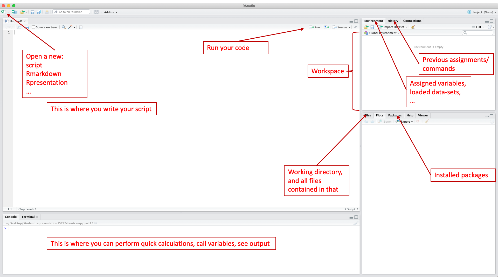

```{r setup, include=FALSE}
options(htmltools.dir.version = FALSE)
knitr::opts_chunk$set(fig.retina = 3, message = FALSE) #rendering sharp plots / not showing messages
```

```{r xaringan-themer, include=FALSE, warning=FALSE}
library(xaringanthemer)
style_mono_light(base_color = "#23395b")

```

# Introduction

---
# Our timetable

- 9:15 - 10:00 (warming up)
  + R in your study program
  + other languages
  + installing R
  + the IDE (Integrated Development Environment)
- 10:00 - 10:15 (Virtual coffee break)
--

- 10:15 - 11:10 (Base R - Part 1)
  + variables and R as calculator
  + data structures (vectors, matrix, lists, indexing, (class(dat)))
  + packages and libraries
  + base plotting
- 11:10 - 11:25 (Another coffee?)
--

- 11:25 - 12:10 (Base R - Part 2)
  + writing scripts (best practices) 
  + data handling
  + (Classes)
  + if-else statements
- 12:10 - 12:30 (Yet, another coffee??)
  + Writing your own code:)

---

# The use of R

- Master in Comparative and International Studies (MACIS)
...
- Master in Science, Technology, and Policy

--
- data analysis and statistical computing
  + R does just that, considered best for graphing and visualizations

.pull-right[

]
  + Python goes beyond data analysis, e.g., web-scraping
  
  (STP course: Big data for Public Policy)
  
  + both borrow packages from eachother however:)


source: https://www.datacamp.com/community/tutorials/r-or-python-for-data-analysis#gs.k=J5=oY
---

# Installing R

If you haven't done already, go to: https://courses.edx.org/courses/UTAustinX/UT.7.01x/3T2014/56c5437b88fa43cf828bff5371c6a924/

- you need both!
  + R is the language
  + Rstudio is your IDE ("user interface")

---
# The IDE



---
# Virtual coffee break #1

- Questions?
- We continue at around 10:15

---
# Variables and R as calculator
```{r, message=FALSE, fig.align='center', fig.height=3, fig.width=3}
# assigning variables
a <- 5
b <- 10

# performing a computation and calling the result 
a + b # (Windows: ... , Mac: cmd + enter)
      # for more shortcuts, see: 
      # https://support.rstudio.com/hc/en-us/articles/200711853-Keyboard-Shortcuts
```

---
## Data structures
+ vector
```{r, message=FALSE, fig.align='center', fig.height=3, fig.width=3}
# creating vectors
x <- c(1:9) # c(...), combines arguments into vector or list
```
+ matrix
+ array
+ lists
+ data frames

---
## Data structures

+ vector
+ matrix
```{r, message=FALSE, fig.align='center', fig.height=3, fig.width=3}
# creating matrices
A <- matrix(x, nrow = 3, ncol = 3)

# assigning row, column and matrix names
rownames(A) <- c("penguin1", "penguin2", "penguin3")
colnames(A) <- c("species", "sex", "year")
matrix_names <- c("set1", "set2")
```
+ array
+ lists
+ data frames

---
## Data structures

+ vector
+ matrix
+ array
```{r, message=FALSE, fig.align='center', fig.height=3, fig.width=3}
array1 <- array(c(A,A), dim = c(3,3,2), 
                dimnames = list(rownames(A), colnames(A), matrix_names))
          # takes multidimensional data objects 
```
+ lists
+ data frames

--- 
## Data structures

+ vector
+ matrix
+ array
+ lists
```{r, message=FALSE, fig.align='center', fig.height=3, fig.width=3}
l1 <- list(x, A, "hello", TRUE, FALSE) # elements of different types
```
+ data frames

---
## Data structures

+ vector
+ matrix
+ array
+ lists
+ data frames (~array)
  - has column names
  - unique rownames
  - handles numeric, factor, or character data
  - each column contains same number of entries


---
# Indexing

```{r, message=FALSE, fig.align='center', fig.height=3, fig.width=3}
x[5] # accessing fifth element of vector

A[2,3] # accessing second row, third column of matrix

A[c(1,2), c(2,3)] # ... 1st and 2nd row of 2nd and 3th column

array1[1,,1] # ... 1st row, all columns, 1st matrix
```
  + for more indexing, see: https://data-flair.training/blogs/data-structures-in-r/

---
# Packages and libraries

Packages
- R is open source, we benefit from packages made 
  (and updated) by the R community 
- they organize work and typically contain:
  + code
  + specific functions
  + documentation ("README's")
  + data-sets
  
- to work with them they need to be installed (do this once for each package)
```{r, message=FALSE, fig.align='center', fig.height=3, fig.width=3, eval=FALSE}
#install.packages("palmerpenguins") # we will need this package later
install.packages(c("palmerpenguins", 
                   "tidyverse", 
                   "ggplot2")) # we will need these packages later
```

Library
- Using a package for a new project, we need to load it (you do this every time)
```{r}
library(palmerpenguins)
```
  + unf. you cannot input a number of libraries at the same time...

.pull-right[

“Artwork by @allison_horst”
]


---
# Base R plotting
- for a quick and simple visualization of your data
- we will mainly use ggplot (tomorrow)

```{r, message=FALSE, fig.align='center', fig.height=3, fig.width=3}
plot(x) # plotting our vector
theme_xaringan()
```

.pull-left[
```{r, message=FALSE, fig.align='center', fig.height=3, fig.width=3}
# visualizing our dataset

hist(penguins$bill_length_mm, # hist(x-data, ...)
     main = "Histogram", 
     xlab = "bill length [mm]")
     theme_xaringan()

plot(penguins$bill_length_mm, penguins$bill_depth_mm,  # plot(x-data, y-data, ...)
     main = "Scatterplot", 
     xlab = "bill length [mm]", ylab = "bill depth [mm]")
     theme_xaringan()
     
boxplot(bill_length_mm ~ species, penguins, # boxplot(y-data ~ x-data, dataframe, ...)
        main = "Boxplot",
        xlab = "bill length [mm]", ylab = "bill depth [mm]")
        theme_xaringan()
```
]

.pull-right[

“Artwork by @allison_horst”
]

- For more, 
see: https://bookdown.org/rdpeng/exdata/the-base-plotting-system-1.html

---
# Writing scripts (best practices)

- set-up
Find and set your working directory

```{r, message=FALSE, fig.align='center', fig.height=3, fig.width=3, eval=FALSE}
getwd() # tells u in which working directory you currently operate
setwd() # let's you set your desired working directory
```

Example:
```{r, message=FALSE, fig.align='center', fig.height=3, fig.width=3, eval=FALSE}
setwd("~/Desktop/Student representation ISTP/rbootcamp/part1/")
```

- Make a separate folder for each project
  + data
  + figures
  + ...

To: 
- keep things tidy
- share your work
- have people replicate your work

- BEST PRACTICE (to be like an expert)
Create a "New project"
  + this does all the above for you
  + allows you to work on mutiple projects simultaneously
  + DOESN'T CLUTTER YOUR WORKSPACE :)

for more, see: 
https://support.rstudio.com/hc/en-us/articles/200526207-Using-Projects

- indenting and commenting
  + comment where necessary, don't go overboard
  + use spaces after each input
  + object names: all lowercase, short, and yet informative
  + use indents to show that something is a part of something
  + ...

- tips and tricks (e.g. helpfunction "?c", create code blocks, using arrow-keys, using tab for autocompletion, using small letters,  Cmd + Shift + C to command out lines
 + type "?<function>" to access help center
 + use "tab" for autocompletion
 + use arrow-keys to navigate previous commands
 + Cmd + Shift + C to command out (several) lines
 + ...
 
---
# Data handling (?)

---
# Classes (?)

---
# If-else statements

- let R perform an action based on if a condition is med or not
- syntax:
  + if (this is true) {do this}
  + else if (an alternative is true) {then do this}
  + else (when none of the above is true) {then do this}
- Simplest example
```{r, message=FALSE, fig.align='center', fig.height=3, fig.width=3}
x
# creating multiple condition statement
if(10 %in% x) {
  print("x is equal to 10")
} else if(20 %in% 10) {
    print("x is equal to 20")
} else if( x < 10 & x >= 0) {
    print("x is a number equal or greater than 0 and smaller than 10")
} else {
    print("the conditions are not med for x")
}
```
NOTE: "if" only takes ONE logical value

- using "ifelse", we access the entire vector, element-by-element:
```{r, message=FALSE, fig.align='center', fig.height=3, fig.width=3}
x

ifelse(x >= 6, "TRUE", "FALSE")
```
---
# Yet, another coffee??

- Reconvene at 12:30

---
# Writing your own code:)

- set-up a project (and check your working directory through the console)
- write name, and date of latest access
- for the following: comment wherever you see fit for someone else to read
- assign a variable (vector, matrix)
- access an index from the vector or matrix
- plot a histogram from your vector
- plot a boxplot and histogram from the penguin data
  + choose interesting variables to analyse
  + include title and lable
  + say something about what you see
- send the code to your peers (?)

---
# That's all folks!

- Any burning questions?
