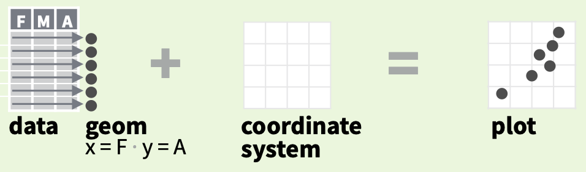
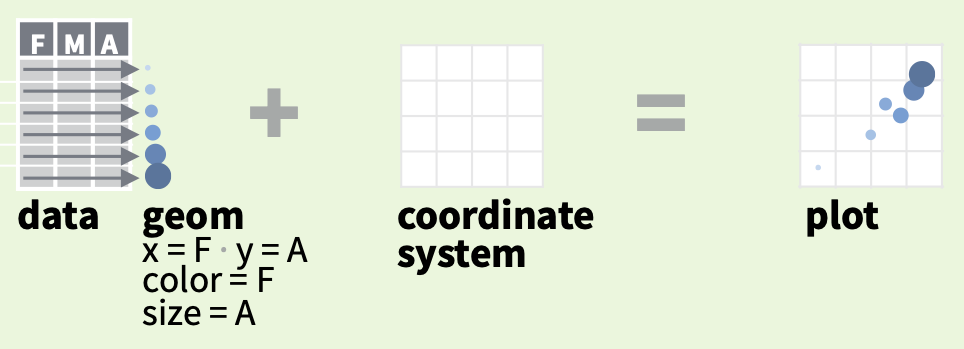
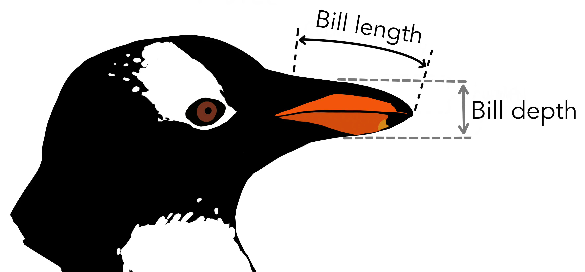

```{r setup, include=FALSE}
options(htmltools.dir.version = FALSE)
knitr::opts_chunk$set(fig.retina = 3, message = FALSE) #rendering sharp plots / not showing messages
```

```{r xaringan-themer, include=FALSE, warning=FALSE}
library(xaringanthemer)
style_mono_light(base_color = "#23395b")
library(tidyverse)
library(palmerpenguins)
```

# Motivation

.pull-left[
```{r, motivation2_left, echo = FALSE, warning=FALSE}
hist(penguins$bill_length_mm, freq = FALSE)
```
]
--

.pull-right[
```{r, motivation2_right, echo = FALSE, warning=FALSE}
ggplot(data=penguins) +
  aes(bill_length_mm) +
  geom_histogram(         
    aes(                  
      fill = species,     
      y = ..density..     
      ),                  
    alpha=0.3             
    ) +                   
  theme_xaringan()
```
]

---
# Motivation

.pull-left[
```{r, motivation1_left, echo = FALSE, warning=FALSE}
boxplot(penguins$bill_length_mm)
```
]
--

.pull-right[
```{r, motivation1_right, echo = FALSE, warning=FALSE}
penguins$year <- 
  as.factor(penguins$year)
ggplot(data = penguins) +
  aes(x = year, 
      y = bill_length_mm) +
  geom_boxplot(
    aes(group=year, 
        color=year), 
    width=0.2,
    outlier.alpha = 0.3) +
  facet_wrap(vars(species)) +
  theme_xaringan() +
  theme(axis.text.x
        =element_blank())
```
]

---
# ggplot2

"The grammar of graphics" -> 3 components make a graph

--

- data
  
--

- coordinate system
  
--

- geometries ("geoms"): visual marks representing data points

--



---
# ggplot2
geom's have properties -> "aesthetics"

--

- x, y

--

- color

--

- size

--



---
# Visualisation practice



(Artwork by @allison_horst,
Data from https://github.com/allisonhorst/palmerpenguins)

---
# 1) Data

.pull-left[
```{r, histogram11, fig.show = 'hide', warning=FALSE}

ggplot(data=penguins)
```
]
.pull-right[
```{r ref.label = 'histogram11', echo = FALSE, warning=FALSE}
```
]

---
# 2) Coordinate System

.pull-left[
```{r, histogram12, fig.show = 'hide', warning=FALSE}

ggplot(data=penguins) +
  aes(x=bill_length_mm) #<<
```
]
.pull-right[
```{r ref.label = 'histogram12', echo = FALSE, warning=FALSE}
```
]

---
# 3) Geometry

.pull-left[
```{r, histogram13, fig.show = 'hide', warning=FALSE}
ggplot(data=penguins) +
  aes(bill_length_mm) +
  geom_histogram() #<<
```
]
.pull-right[
```{r ref.label = 'histogram13', echo = FALSE, warning=FALSE}
```
]

---
# ... labeling

.pull-left[
```{r, histogram14, fig.show = 'hide', warning=FALSE}

ggplot(data=penguins) +
  aes(bill_length_mm) +
  geom_histogram() + 
  labs(x="Bill length (mm)", #<<
       title="Histogram") +  #<<
  theme_xaringan()           #<<
```
]
.pull-right[
```{r ref.label = 'histogram14', echo = FALSE, warning=FALSE}
```
]

---
# Distinguishing species via colors

.pull-left[
```{r, histogram2, fig.show = 'hide', warning=FALSE}

ggplot(data=penguins) +
  aes(bill_length_mm) +
  geom_histogram(        #<<
    aes(fill = species)  #<<
    ) +                  #<<
  theme_xaringan()
```
]
.pull-right[
```{r ref.label = 'histogram2', echo = FALSE, warning=FALSE}
```
]

---
# Recap 1

- a trio of __data__ + __coordinate system__ + __geometries__ makes a ggplot

--

- certain __properties__ can be assigned to __geometries__ via __aes()__

--

- we can create plots through applying a __logical sequence of commands connected by *+* signs__

--

- Histograms are created with via *geom_histogram*

--

- Labels can be assigned with via *labs*

--

- within *aes()*, the *fill* property can be used to __distinguish different categories in your data set__

--

# Any questions so far?

---
# Scatterplot

.pull-left[
```{r, scatterplot1, fig.show = 'hide', warning=FALSE}
ggplot(data = penguins) +
  aes(x = bill_length_mm, 
      y = bill_depth_mm) +
  geom_point(size = 2) +
  theme_xaringan()
```
]
.pull-right[
```{r ref.label = 'scatterplot1', echo = FALSE, warning=FALSE}
```
]

---
# Add a linear regression line

.pull-left[
```{r, scatterplot1.1, fig.show = 'hide', warning=FALSE}
ggplot(data = penguins) +
  aes(x = bill_length_mm, 
      y = bill_depth_mm) +
  geom_point(size = 2) +
  geom_smooth(method="lm",    #<<
              color="blue") + #<<
  theme_xaringan()
```
]
.pull-right[
```{r ref.label = 'scatterplot1.1', echo = FALSE, warning=FALSE}
```
]

---
# Distinguish species with colors

.pull-left[
```{r, scatterplot2, fig.show = 'hide', warning=FALSE}
ggplot(data = penguins) +
  aes(x = bill_length_mm, 
      y = bill_depth_mm) +
  geom_point(                 #<<
    aes(color = species,      #<<
        shape = species),     #<<
    size = 2) +               #<<
  geom_smooth(method="lm",   
              color="blue") +
  theme_xaringan()
```
]
.pull-right[
```{r ref.label = 'scatterplot2', echo = FALSE, warning=FALSE}
```
]

---
# Category-specific regression lines

.pull-left[
```{r, scatterplot3, fig.show = 'hide', warning=FALSE}
ggplot(data = penguins) +
  aes(x = bill_length_mm, 
      y = bill_depth_mm) +
  geom_point(
    aes(color = species, 
        shape = species),
    size = 2
    ) + 
  geom_smooth(           #<<
    method = "lm",       #<<
    se = TRUE,           #<<
    aes(color = species) #<<
    ) +                  #<<
  theme_xaringan()
```
]
.pull-right[
```{r ref.label = 'scatterplot3', echo = FALSE, warning=FALSE}
```
]

--

Simpson's paradox: https://en.wikipedia.org/wiki/Simpson%27s_paradox

---
# Recap 2

- __Scatterplots__ are created via *geom_point*

--

- __Regression lines__ can be fit to the data points via *geom_smooth*. We learned about the *'lm'* method, but many other (non-linear) methods are available.

--

- Within *aes()*, the *color* and *shape* properties can be used to distinguish categories in your data

--

- __Category-specific regression lines__ can be fitted by specifying the category in *aes()*

--

- A bit off-topic, but important: Unraveling __categorical clusters__ in your data is crucial for gaining valid insights (*Simpson's paradox*)

--

# Questions?

---
# Boxplot: x = species

.pull-left[
```{r, boxplot, fig.show = 'hide', warning=FALSE}
ggplot(data = penguins) +
  aes(x = species, 
      y = bill_length_mm) +
  geom_boxplot() + #<<
  theme_xaringan()
```
]
.pull-right[
```{r ref.label = 'boxplot', echo = FALSE, warning=FALSE}
```
]

---
# Boxplot: x = year

.pull-left[
```{r, facet_wrap1, fig.show = 'hide', warning=FALSE}
ggplot(data = penguins) +
  aes(x = year, #<<
      y = bill_length_mm) +
  geom_boxplot(
    aes(group=year), 
    width=0.2,
    outlier.alpha = 0.3) + 
  theme_xaringan()
```
]
.pull-right[
```{r ref.label = 'facet_wrap1', echo = FALSE, warning=FALSE}
```
]

---
# What if we want to visualise both?

__Facetting__: building multi-panel plots

--

.pull-left[
```{r, facet_wrap2, fig.show = 'hide', warning=FALSE}
ggplot(data = penguins) +
  aes(x = year, 
      y = bill_length_mm) +
  geom_boxplot(
    aes(group=year, 
        color=year), 
    width=0.2,
    outlier.alpha = 0.3) +
  facet_wrap( #<<
    vars(species), #<<
    ncol=1) + #<<
  theme_xaringan()
```
]
.pull-right[
```{r ref.label = 'facet_wrap2', echo = FALSE, warning=FALSE}
```
]

---
# Facetting: *ncol=3*

.pull-left[
```{r, facet_wrap21, fig.show = 'hide', warning=FALSE}
ggplot(data = penguins) +
  aes(x = year, 
      y = bill_length_mm) +
  geom_boxplot(
    aes(group=year, 
        color=year), 
    width=0.2,
    outlier.alpha = 0.3) +
  facet_wrap( #<<
    vars(species), #<<
    ncol=3) + #<<
  theme_xaringan()
```
]
.pull-right[
```{r ref.label = 'facet_wrap21', echo = FALSE, warning=FALSE}
```
]

---
# Removing x-labels for beautification

.pull-left[
```{r, facet_wrap3, fig.show = 'hide', warning=FALSE}
ggplot(data = penguins) +
  aes(x = year, 
      y = bill_length_mm) +
  geom_boxplot(
    aes(group=year, 
        color=year), 
    width=0.2,
    outlier.alpha = 0.3) +
  facet_wrap(
    vars(species),
    ncol=3) +
  theme_xaringan() + 
  theme(axis.text.x #<<
        =element_blank()) #<<
```
]
.pull-right[
```{r ref.label = 'facet_wrap3', echo = FALSE, warning=FALSE}
```
]

---
# Recap 3

- __Boxplots__ are created via *geom_boxplot*. We need to specify *x* and *y* within *aes()* for R to know relationships to plot

--

- We can change the width of a geometry via *width* and change the opacity of outliers in *geom_boxplot* via *outlier.alpha*

--

- **facet_wrap** is a powerful command that let's us create multiple panels called *facets* for different units in a category

--

- We can hide the x-labels of a plot by calling *theme(axis.text.x=element_blank())*.

--

# Questions?

---
# Enough said...


