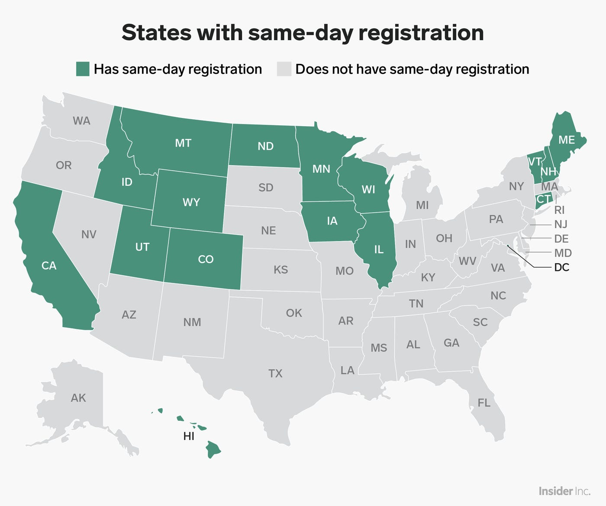
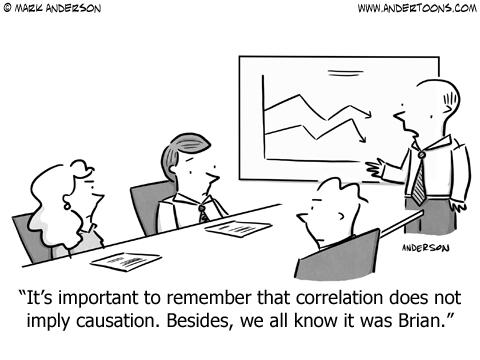

```{r setup, include=FALSE}
options(htmltools.dir.version = FALSE)
knitr::opts_chunk$set(fig.retina = 3, message = FALSE) #rendering sharp plots / not showing messages
```

```{r xaringan-themer, include=FALSE, warning=FALSE}
library(xaringanthemer)
style_mono_light(base_color = "#23395b")
library(tidyverse)
```

### Election day registration & voter turnout in the US
.pull-left[
- The majority of states require voters to *register two to four weeks before an election*. [(Wikipedia)](https://en.wikipedia.org/wiki/Voter_registration_in_the_United_States#Election_Day_/_same-day)

- "There is *strong evidence that same day and Election Day registration increases voter turnout*, but the extent of the impact is difficult to conclude. 

- Multiple studies place the *effect between an increase of 3 to 7 percent*, with an **average of a 5 percent increase**." [(NCLS)](https://www.ncsl.org/research/elections-and-campaigns/same-day-registration.aspx)
]

.pull-right[

[(Source: businessinsider.com, November 2018.)](https://www.businessinsider.com/last-day-voter-registration-deadline-by-state-2018-10?r=US&IR=T)
]


---
# Research question

.pull-left[
We want to examine ourselves **if introducing election day registration has an impact on voter turnout**.

We will try to understand the **effect of EDR upon voter turnout** in the state of Maine.

If time allows, we will go one step further and ask: 

What is the **causal effect** of EDR upon voter turnout in the US, and is our estimate in the *range of values provided in the literature*, i.e., **5% on average**?
]

--

.pull-right[


[*(Source: Andertoons)*](https://andertoons.com/science/cartoon/7252/correlation-does-not-imply-causation-we-know-it-was-brian)

(Acknowledgment: this exercise is based on an assignment created by our former Statistics I lecturer Liam Beiser-McGreith. Thanks, Liam!)

]

---
# The data set

We use data on **US states** for all **presidential elections from 1920 to 2012**.

--

.pull-left[
```{r, warning=FALSE}
# load data set
library(gsynth)
data(gsynth)
rm(list = c("simdata"))
```
]
.pull-right[
Reference: [*Melanie Jean Springer. 2014. How the States Shaped the Nation: American Electoral Institutions and Voter Turnout, 1920-2000. University of Chicago Press.*](https://rdrr.io/cran/gsynth/man/turnout.html)
]

---

```{r, warning=FALSE}
# inspect data
str(turnout)

# unique states
length(unique(turnout$abb))

# unique years
length(unique(turnout$year))
```

---
### Exercise

We first focus on the state **Maine** (abb = "ME"). Maine introduced *election day registration (EDR)* in the year **1976**.

--

1) **Plot turnout in Maine over the 1920-2012 time period.** 

**Hint**: First, you need to *filter* for Maine (abb = "ME"). For the plot *geom_line* and *geom_point* might be suitable functions. Note that years should be on the x-axis, while turnout should be on the y-axis.

--

2) **Distinguish between the period before and after EDR was introduced in Maine**. 

These are commonly called the *"pre-" and "post-treatment"* periods respectively, where the term "treatment" specifically refers to the introduction of EDR. After you have done so, split the pre- and post-treatment data and assign them to two new variables *pre* and *post*, respectively. 

**Hint**: Use *mutate* to add another column called *treatment* to the data set that consists out of 0 and 1 values, where 1 should be assigned to all rows starting 1976 and 0 to all rows before that (an *ifelse* clause might be handy). Use *filter* to split the pre- and post-treatment data.

---
### Exercise

3) **Update your plot further**. 

Visualise the *time EDR was introduced* to distinguish *pre- and post-treatment periods* and the *mean values of pre- and post-treatment turnout* in Maine. In the end, *label* your plot.

--> *Do you observe a notable difference in pre- and post-treatment mean turnout?*

**Hint**: use *geom_vline* to visualise the EDR introduction time and *geom_segment* to indicate pre- and post-treatment period mean turnout. Use *labs* to assign x/y labels and a title.

---
# Go for it!


---
### 1) Plot turnout in Maine over 1920 - 2012.

.pull-left[
```{r, maine1, fig.show = 'hide', warning=FALSE}
turnout_maine <- turnout %>%
  filter(abb == 'ME')

ggplot(turnout_maine) +
  aes(y=turnout, x=year) +
  geom_line() + 
  geom_point() + 
  theme_xaringan()
```
]
.pull-right[
```{r ref.label = 'maine1', echo = FALSE, warning=FALSE}
```
]

---
### 2) Distinguish between pre- and post-EDR periods

```{r}
# filter and mutate
turnout_maine <- turnout_maine %>%
  mutate(treatment=ifelse(year >= 1976, 1, 0))

# disentangle treatment groups
pre <- turnout_maine %>% 
  filter(treatment == 0)
post <- turnout_maine %>% 
  filter(treatment == 1)
```

---
### 3) Update plot

.pull-left[
```{r maine2, fig.show = 'hide', warning=FALSE}
ggplot(turnout_maine) +
  aes(y=turnout, x=year) +
  geom_line() + 
  geom_point() + 
  geom_vline(xintercept=1976) +
  geom_segment(
    x=first(pre$year), 
    xend=last(pre$year), 
    y=mean(pre$turnout), 
    yend=mean(pre$turnout),
    color='darkgreen') +  
  geom_segment(
    x=first(post$year), 
    xend=last(post$year), 
    y=mean(post$turnout), 
    yend=mean(post$turnout),
    color='darkred') +
  labs(
    title = "Maine",
    x = "Year", 
    y = "Voter turnout (%)") +
  theme_xaringan()
```
]
.pull-right[
```{r ref.label = 'maine2', echo = FALSE, warning=FALSE}

```

Pre-treatment mean turnout: `r round(mean(pre$turnout), 2) `%
Post-treatment mean turnout: `r round(mean(post$turnout), 2)`%
Difference: `r round(mean(post$turnout) - mean(pre$turnout), 2) `%

]

---
### Bonus exercise (to be continued at home (-: )

- We now go one step further and ask a more general question: **what is the causal effect of EDR upon voter turnout in the US** as a whole?

--

- This means that we not only need to distinguish between **pre- and post-treatment periods** (i.e., the time EDR was introduced in a state, e.g., in Maine), but also between **treatment and control group states**. *Treatment group states* are those where EDR was introduced, while *control group states* are those where it was not introduced over the observed time period. The *control group states* provide what is called the **counterfactual** in policy jargon, i.e., "what would have happened if no policy was introduced?".

---
### Bonus exercise

- Essentially, you will work with a combination of **4 subsets of the original data**: 
  1. the **pre-treatment subset**
  2. the **post-treatment subset**
  3. the **treatment subset**
  4. the **control subset**

--

- We will only **focus on those states that introduced EDR in 1976**. There are *6 states that introduced EDR at other points in time *throughout our observation period, but we will *neglect* them for the time being in order to *simplify the analysis*. Note that since we do not exploit the full range of information availabe, our *estimates will be somewhat biased*. There are techniques for addressing this and you will (probably) learn about them in the future. 

---
### Bonus exercise: steps and hints

1) Find the treatment group states (subset 3): use *filter* with conditions to find all states that introduced EDR in 1976 (Hint: ME, MN, WI). Assign to a new variable called *states_E1*.

2) Find the control group states (subset 4): use *group_by*, *summarise*, *filter* and *select* to find all states that didn't introduce EDR within our observation period. Assign to a new variable called *states_E0*.

3) Now, focus on the time dimension in the control group subset: use *filter* to distinguish between pre- and post-treatment subsets within the control group. Assign the resulting data frames to variables called *E0T0* and *E0T1*, respectively. Calculate the mean $\mu_{turnout}$ (over the time dimension) for both variables.

4) Next, focus on the time dimension in the treatment group subset: use *filter* to distinguish between pre- and post-treatment subsets within the treatment group. Assign the resulting data frames to variables called *E1T0* and *E1T1*, respectively. Calculate the mean $\mu_{turnout}$ (over the time dimension) for both variables.

---
### Bonus exercise: steps and hints

... continued ...

5) **Plot** turnout across all states over time, distinguishing between election day registration states and non-election day registration states, as well as pre- and post-treatment periods.

6) Lastly, estimate the **average effect of EDR on voter turnout** through double-differencing of mean turnout within each of the 4 subsets:

$$DID = (\mu_{E1T1} - \mu_{E1T0}) - (\mu_{E0T1} - \mu_{E0T0})$$

---
### Solution to Exercise 2: steps 1 and 2

```{r did0, warning=FALSE}
yrs <- unique(turnout$year) # years
states <- unique(turnout$abb) # states

# treatment group data
states_E1 <- unique(
  filter(
    turnout, (policy_edr == 1 & year == 1976))$abb
  ) 

# control group data
states_E0 <- turnout %>%
  group_by(abb) %>%
  summarise(sum_policy_edr = sum(policy_edr)) %>% 
  filter(sum_policy_edr == 0) %>% 
  select(abb)
states_E0 <- states_E0$abb
```

---
### Solution to Exercise 2: step 3

```{r did1, warning=FALSE}
# Control group elements: E0T0, E0T1
E0 <- turnout %>% filter(abb %in% states_E0)
E0T0 <- E0 %>% filter(year < 1976)
E0T1 <- E0 %>% filter(year >= 1976)

E0T0_mean <- E0T0 %>%
  group_by(year) %>%
  summarise(mean_turnout = mean(turnout))

E0T1_mean <- E0T1 %>%
  group_by(year) %>%
  summarise(mean_turnout = mean(turnout))
```

---
### Solution to Exercise 2: step 4

```{r did2, warning=FALSE}
# Treatment group elements: E1T0, E1T1
E1 <- turnout %>% filter(abb %in% states_E1)
E1T0 <- E1 %>% filter(year < 1976)
E1T1 <- E1 %>% filter(year >= 1976)

E1T0_mean <- E1T0 %>%
  group_by(year) %>%
  summarise(mean_turnout = mean(turnout))

E1T1_mean <- E1T1 %>%
  group_by(year) %>%
  summarise(mean_turnout = mean(turnout))
```

---
### Solution to Exercise 2: step 5

```{r did3_0, warning=FALSE, fig.show = 'hide'}
# plot
ggplot() +
  geom_vline(xintercept=1976, 
             linetype='dashed') + 
  # E0T0
  geom_point(data = E0T0_mean, 
             aes(x=year, y=mean_turnout), 
             colour='red') +
  geom_line(data = E0T0_mean, aes(x=year, y=mean_turnout), 
            colour='red') +
  geom_segment(data = E0T0_mean, 
               x=first(E0T0_mean$year), 
               xend=last(E0T0_mean$year), 
               y=mean(E0T0_mean$mean_turnout), 
               yend=mean(E0T0_mean$mean_turnout), 
               color='red', 
               linetype='dashed') + 
  # labeling
  labs(title = "Turnout across states",
       x = "Year", y = "Mean voter turnout (%)") + 
  theme_xaringan()
```

---
### Solution to Exercise 2: step 5

.pull-left[
```{r did4, echo = FALSE, warning=FALSE}
# plot
ggplot() +
  geom_vline(xintercept=1976, linetype='dashed') + 
  # E0T0
  geom_point(data = E0T0_mean, aes(x=year, y=mean_turnout), colour='red') +
  geom_line(data = E0T0_mean, aes(x=year, y=mean_turnout), colour='red') +
  geom_segment(data = E0T0_mean, x=first(E0T0_mean$year), xend=last(E0T0_mean$year), 
               y=mean(E0T0_mean$mean_turnout), yend=mean(E0T0_mean$mean_turnout), 
               color='red', linetype='dashed') +
  # E0T1
  geom_point(data = E0T1_mean, aes(x=year, y=mean_turnout), colour='red') + 
  geom_line(data = E0T1_mean, aes(x=year, y=mean_turnout), colour='red') + 
  geom_segment(data = E0T1_mean, x=first(E0T1_mean$year), xend=last(E0T1_mean$year), 
               y=mean(E0T1_mean$mean_turnout), yend=mean(E0T1_mean$mean_turnout), 
               color='red', linetype='dashed') +
  # E1T0
  geom_point(data = E1T0_mean, aes(x=year, y=mean_turnout), colour='darkblue') + 
  geom_line(data = E1T0_mean, aes(x=year, y=mean_turnout), colour='darkblue') + 
  geom_segment(data = E1T0_mean, x=first(E1T0_mean$year), xend=last(E1T0_mean$year), 
               y=mean(E1T0_mean$mean_turnout), yend=mean(E1T0_mean$mean_turnout), 
               color='darkblue', linetype='dashed') +
  
  # E1T1
  geom_point(data = E1T1_mean, aes(x=year, y=mean_turnout), colour='darkblue') + 
  geom_line(data = E1T1_mean, aes(x=year, y=mean_turnout), colour='darkblue') + 
  geom_segment(data = E1T1_mean, x=first(E1T1_mean$year), xend=last(E1T1_mean$year), 
               y=mean(E1T1_mean$mean_turnout), yend=mean(E1T1_mean$mean_turnout), 
               color='darkblue', linetype='dashed') + 
  # labeling
  labs(title = "Turnout across states",
       x = "Year", y = "Mean voter turnout (%)") + 
  theme_xaringan()
```
]
.pull-right[
The figure shows group-aggregated mean voter turnout over time. It can easily be seen that the treatment-group mean increased between pre- and post-treatment, while the control-group mean did not change a lot. 

**But: is the change in treatment-group mean turnout really in response to the introduction of EDR?**
]

---
### Solution to Exercise 2: step 6

.pull-left[
```{r did5, warning=FALSE}

# treatment group difference
diff_treatment <- 
  mean(E1T1$turnout) - 
  mean(E1T0$turnout)

# control group difference
diff_control <-
  mean(E0T1$turnout) - 
  mean(E0T0$turnout)

# treatment - control
DID <- diff_treatment - 
  diff_control
```
]
.pull-right[
The average **causal effect** of EDR on voter turnout is **`r round(DID, 2)`%**.
]

---
### Congratulations!

Without knowing so, you have completed your first causal inference using a quasi-experimental technique called **Difference in Differences**, in short **DID**. You will learn more about this and other related methods in your studies.

--

Thanks for being part of the very first edition of the **MACIS-STP R Crash Course** (-:

--

Now it's time for a **final 20 min break** and **giving feeback**.

--

Please take the time and fill out the feedback form [**by following this link (click)**](https://docs.google.com/forms/d/e/1FAIpQLSfRCdY-WfyuLMUKC3_BLXr0YJXeFs9gWcD__KUJYUSdGXgxLA/viewform) during the break. Your feedback is invaluable for improving the **MACIS-STP R Crash Course** for next year.

--

We **reconvene at 15:20** for a final wrap up and end at **15:45**.
